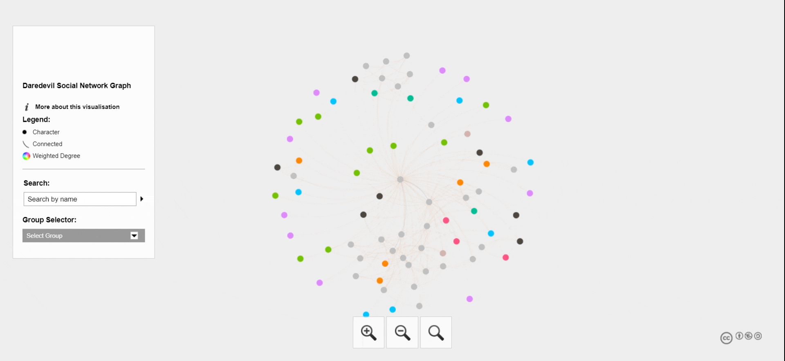

## Welcome to my page!
Hi! Thank you for checking out my page. My name is Quoc Huynh and I am a 3rd year student at UC Berkeley studying Data Science with an emphasis in Economics.
I am from East Side San Jose, California and am a first generation student. Some of my personal interests include comic books,
The [Arctic Monkeys](https://www.arcticmonkeys.com/), soccer, and NFTs! 

  

## Some Of My Highlighted Projects

<h2 align = "center">
    <a href="https://quoc-huynh.github.io/Daredevil_Graph/">Daredevil Social Network Graph</a> 
</h2>
