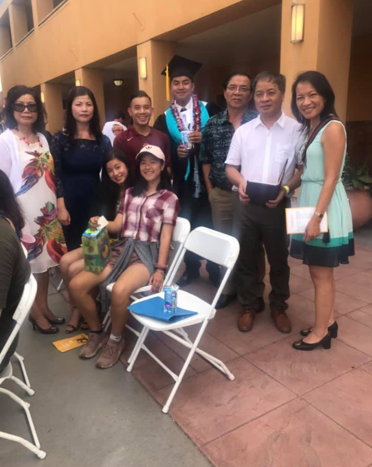
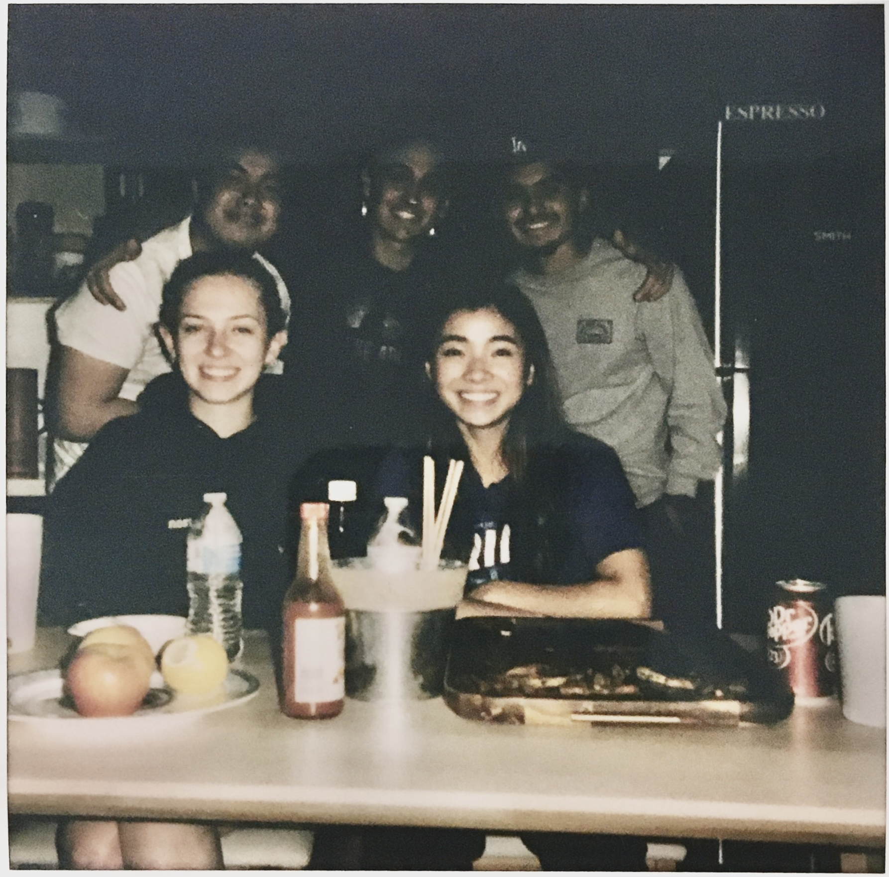
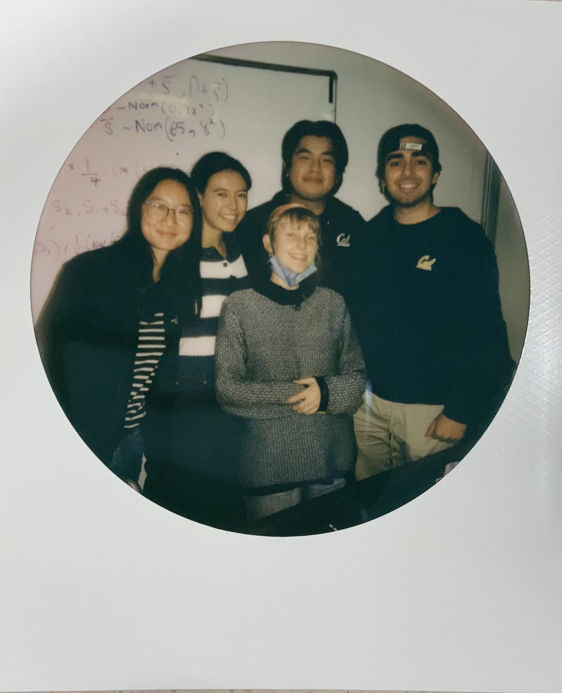

## Welcome to my page!
Hi! Thank you for checking out my page. My name is Quoc Huynh and I am a 3rd year student at UC Berkeley studying Data Science with an emphasis in Economics.
I am from East Side San Jose, California and am a first generation student. Below are some of my highlighted projects that you can check out! Some of my personal interests include [Marvel's Daredevil](https://www.marvel.com/characters/daredevil-matthew-murdock), [The Arctic Monkeys](https://www.arcticmonkeys.com/), [Soccer](https://www.liverpoolfc.com/), and [NFTs](https://www.veve.me/)! 

I would also like to use this space to give thanks and show my appreciation to these people who have helped me through my journey through college and in life.

  
  
  

 

## Some Of My Highlighted Projects

  

<h3 align = "center">
    <a href="https://quoc-huynh.github.io/Daredevil_Graph/">Daredevil Social Network Graph</a> 
</h3>

  

<h3 align = "center">
    <a href="https://github.com/quoc-huynh/PersonalProjects/tree/main/Veve_Comic_Books">Veve's Digital Comic Market Analysis (In Development)</a> 
</h3>

  

<h3 align = "center">
    <a href="https://qarcticcircle.wordpress.com/">Personal Blog</a> 
</h3>

  

<h3 align = "center">
    <a href="https://github.com/quoc-huynh/PersonalProjects/tree/main/Baseball_Pitches">Predicting Baseball Pitches Group Project</a>
</h3>

 

  You can also check out my other projects at my
  <a href="https://github.com/quoc-huynh/PersonalProjects">github!</a>

     
